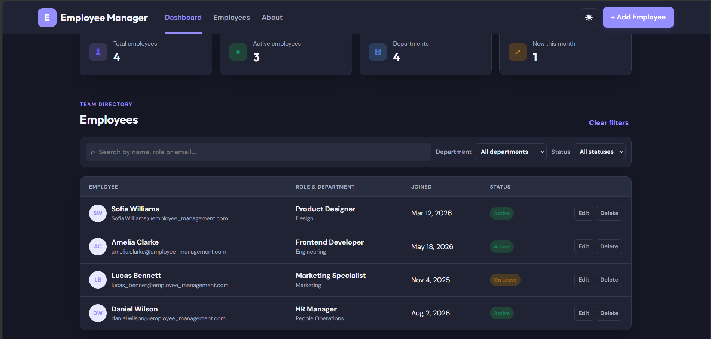

# Employee Manager

A responsive Employee Management Dashboard built with HTML, CSS, and vanilla JavaScript.

Employee Manager provides a clean interface for managing employee records, viewing workforce statistics, searching employees, filtering by department and status, and performing basic employee CRUD operations.

---

## 🚀 Live Demo

[View Live Demo](http://127.0.0.1:5500/index.html)

---
## 📸 Project Preview



---

## 📌 About the Project

Employee Manager is a frontend employee management dashboard designed to demonstrate practical web development concepts using native browser technologies.

The application allows users to manage employee information through a responsive dashboard interface without requiring a backend server.

Employee data is persisted in the browser using the Web Storage API (`localStorage`).

The project focuses on:

- Clean and responsive UI design
- Semantic HTML
- Modern CSS
- Vanilla JavaScript
- DOM manipulation
- CRUD operations
- Search and filtering
- Client-side data persistence
- Form validation
- Theme switching
- Accessibility fundamentals
- Responsive design

---

## ✨ Features

### 📊 Dashboard Statistics

The dashboard dynamically displays:

- Total employees
- Active employees
- Number of departments
- Employees who joined during the current month

### 👥 Employee Management

Users can:

- Add employees
- Edit employee information
- Delete employees
- View employee records
- Assign employee status
- Assign departments
- Set joining dates

### 🔎 Search

Employees can be searched by:

- Name
- Email
- Job title
- Department

### 🔽 Filters

Employees can be filtered by:

- Department
- Status

Available statuses:

- Active
- On Leave
- Inactive

### 🌓 Dark / Light Theme

The application includes a theme toggle that allows users to switch between:

- Light mode
- Dark mode

The selected theme is saved using `localStorage`.

### 💾 Persistent Data

Employee records are stored in the browser using the Web Storage API:

```javascript
localStorage
```

This allows employee data to remain available after refreshing the page in the same browser.

> Note: This project does not use a backend database. Data is stored locally in the user's browser.

---

## 🛠️ Technologies Used

- HTML5
- CSS3
- JavaScript (ES6+)
- Web Storage API
- DOM API
- Google Fonts

---

## 📂 Project Structure

```text
employee-management-system/
│
├── index.html
├── main.css
├── app.js
├── Read.md
│
└── assets/
    └── dashboard-preview.png
```

### File Responsibilities

**`index.html`**

Contains the semantic structure of the dashboard, employee table, filters, forms, modal, navigation, and footer.

**`main.css`**

Contains the complete visual design, responsive layouts, theme variables, components, buttons, tables, forms, modal, and accessibility styling.

**`app.js`**

Handles:

- Employee data management
- Rendering employee records
- Add employee functionality
- Edit employee functionality
- Delete employee functionality
- Search
- Filtering
- Dashboard statistics
- Modal interactions
- Theme switching
- `localStorage` persistence

**`assets/dashboard-preview.png`**

A preview screenshot of the completed Employee Manager dashboard.

---

## 🧠 JavaScript Concepts Demonstrated

This project demonstrates practical JavaScript concepts including:

- Variables and constants
- Arrays and objects
- Functions
- Arrow functions
- Array methods
- `map()`
- `filter()`
- `find()`
- `findIndex()`
- `Set`
- Template literals
- Destructuring and spread syntax
- DOM manipulation
- Event listeners
- Event delegation
- Form handling
- Browser `localStorage`
- Date handling
- `Intl.DateTimeFormat`
- Basic error handling with `try...catch`
- Client-side HTML escaping

---

## ♿ Accessibility

The application includes several accessibility considerations:

- Semantic HTML elements
- Proper form labels
- Accessible button labels
- ARIA attributes where appropriate
- Keyboard support for closing the modal
- Visible focus states
- Screen-reader-friendly hidden content
- `noscript` fallback message

---

## 📱 Responsive Design

The dashboard is designed to work across:

- Desktop
- Tablet
- Mobile devices

CSS media queries adjust:

- Navigation
- Statistics cards
- Search and filter controls
- Employee form layout
- Header actions
- Overall spacing and layout

---

## 🔐 Data & Privacy

This is a client-side demonstration project.

No employee information is sent to a server.

All employee records are stored locally using the browser's `localStorage`.

The sample employee information included in this project is demonstration data.

---

## ▶️ Running the Project Locally

### 1. Clone the repository

```bash
git clone YOUR_GITHUB_REPOSITORY_URL
```

### 2. Open the project

Open the project folder in Visual Studio Code.

### 3. Run the application

You can open `index.html` directly in a browser or use the **Live Server** extension in Visual Studio Code.

---

## 🎯 Project Goals

This project was created to strengthen practical frontend development skills by building a complete interactive application using only browser-native technologies.

The main goal was to move beyond static HTML/CSS pages and implement real application behavior using vanilla JavaScript.

---

## 🚧 Future Improvements

Possible future improvements include:

- Backend API integration
- Database integration
- User authentication
- Employee profile pages
- Pagination
- Sorting by columns
- Advanced form validation
- Toast notifications
- Import/export employee data
- REST API integration
- Role-based access control

---

## 👨‍💻 Author

**Pankaj Dhad**

BSc Computer Science Graduate  
Aspiring Full Stack Developer

---

## 📄 License

This project is created for learning and portfolio purposes.